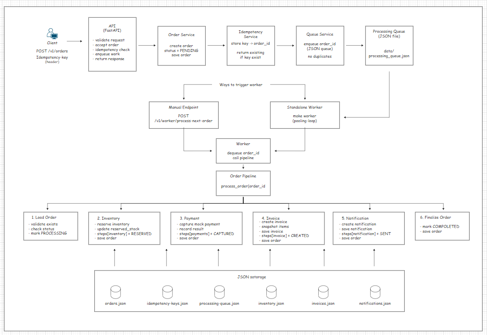
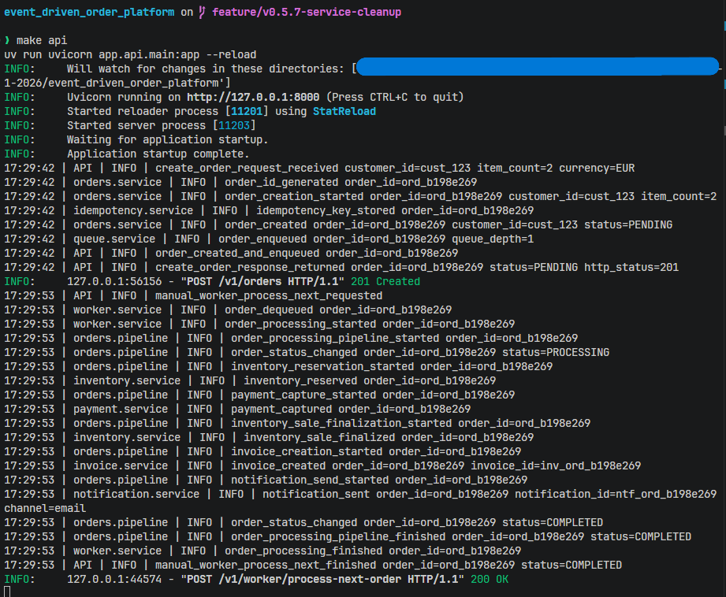
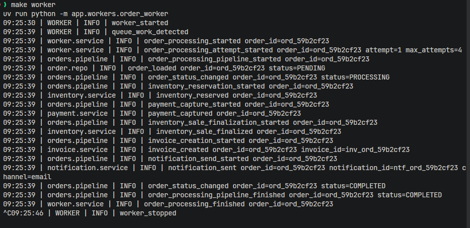

# Event-Driven Order Processing Platform

This is a local-first backend project that builds toward a production-style, AWS-first event-driven order processing platform.

The goal is to learn and document how real backend systems handle:

- asynchronous processing
- failure recovery (DLQ, retries)
- idempotent APIs
- stateful workflows
- observability and operational insight

The project is intentionally built in small versions. Each version adds one backend/platform concept and keeps a public version history of the progression.

## Version History

The project progression is documented in [docs/version_history.md](docs/version_history.md).

## Current Status

Current version: `v0.5.8`

The current local version includes:

- FastAPI order API
- idempotent order creation with `Idempotency-Key`
- local processing queue
- manual worker processing endpoint
- standalone worker process experiment
- JSON-backed local persistence
- structured local logging for API, worker, queue, and pipeline services
- environment-based settings with safe defaults in `.env.example`
- cleaner service boundaries for order storage, idempotency, and order processing
- architecture and concept docs for the local system model
- local order pipeline diagram
- order processing pipeline:
  - reserve inventory
  - capture mock payment
  - create invoice
  - send notification
  - mark order completed

## Local Architecture

Current local implementation:

```text
FastAPI API
  -> creates PENDING order
  -> stores order in JSON
  -> writes order_id to JSON queue

Worker
  -> reads queued order_id
  -> loads order from JSON
  -> processes business pipeline
  -> persists updated state to JSON
```

Logging is intentionally local and simple for now:

```text
API               -> request/response flow
worker.runtime    -> worker lifecycle
worker.service    -> queue consumption
orders.service    -> order creation/idempotency helpers
orders.pipeline   -> order processing workflow
queue.service     -> queue mutations
inventory.service -> inventory changes
payment.service   -> mock payment events
invoice.service   -> invoice creation
notification.service -> notification creation
```

The current logging setup keeps separate named loggers for API, worker, and services even though they mostly share the same stdout formatting. This is intentional for now: the names make the flow easier to trace locally, and the formatter/handler setup can be simplified or changed later when the logging direction becomes clearer.

Current service split:

```text
orders.service        -> create/load/save orders
idempotency.service   -> idempotency key lookup/storage
orders.pipeline       -> processing workflow
queue.service         -> queue persistence
inventory.service     -> inventory state changes
payment.service       -> mock payment capture
invoice.service       -> invoice records
notification.service  -> notification records
```

Local storage files:

```text
data/orders.json
data/idempotency_keys.json
data/processing_queue.json
data/inventory.json
data/invoices.json
data/notifications.json
```

## Documentation

Architecture and concept docs:

- [Architecture](docs/architecture.md)
- [Order processing flow](docs/concepts/order-processing-flow.md)
- [Worker model](docs/concepts/worker-model.md)
- [Storage model](docs/concepts/storage-model.md)
- [Logging](docs/concepts/logging.md)
- [Configuration](docs/concepts/configuration.md)
- [Failure handling](docs/concepts/failure-handling.md)

## Screenshots

Local order pipeline diagram:



Manual worker processing through the API:



Standalone worker processing queued work:



## AWS Mapping

The local implementation is designed to map to AWS later:

| Local component | Future AWS equivalent |
| --- | --- |
| FastAPI API | API Gateway + Lambda |
| JSON orders storage | DynamoDB orders table |
| JSON idempotency storage | DynamoDB idempotency table |
| JSON processing queue | SQS |
| JSON inventory storage | DynamoDB inventory table |
| JSON invoices | S3 / DynamoDB metadata |
| JSON notifications | SNS / notification records |
| Worker process | Lambda worker |

## Run Locally

This project uses [`uv`](https://docs.astral.sh/uv/) for Python dependency and command management.

Install `uv` first if it is not already available:

```bash
curl -LsSf https://astral.sh/uv/install.sh | sh
```

Install project dependencies:

```bash
uv sync --dev
```

Start the API:

```bash
make api
```

Create an order:

```bash
make api-create-order-1
```

Process the next queued order manually:

```bash
make worker-process-next
```

Run the standalone worker experiment:

```bash
make worker
```

Reset local JSON data:

```bash
make storage-reset
```

## API Endpoints

Main endpoints:

```http
POST /v1/orders
GET /v1/orders
GET /v1/orders/{order_id}
POST /v1/worker/process-next-order
```

Debug endpoints:

```http
GET /v1/debug/processing-queue
GET /v1/debug/inventory
GET /v1/debug/invoices
GET /v1/debug/notifications
GET /v1/debug/idempotency-keys
```

## Quality Gates

The repository uses Ruff for linting/formatting checks.

Local commands:

```bash
make check
make format
make lint
```

GitHub Actions currently runs Ruff checks, and the `main` branch is protected so required checks must pass before merging.

## Roadmap

Next planned versions:

- `v0.5.9` - contract models foundation
- `v0.6.0` - repository / adapter foundation
- `v0.6.1` - failure handling
- `v0.6.2` - retry/backoff simulation
- `v0.6.3` - local DLQ simulation
- `v0.7.0` - tests
- `v0.8.0` - documentation polish
- `v1.0.0` - local Phase 1 MVP complete
