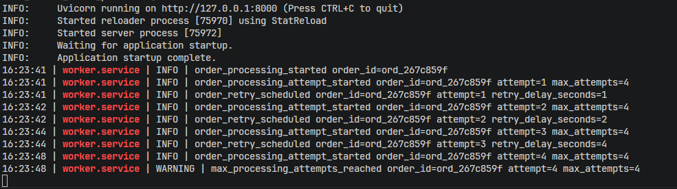
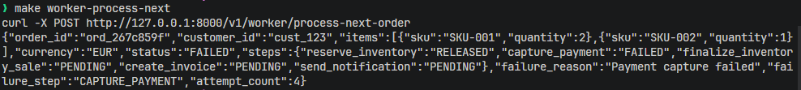
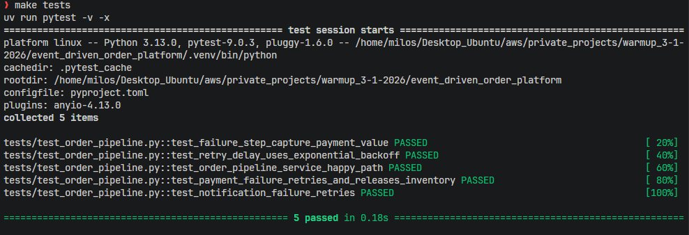

# Event-Driven Order Processing Platform

This is a local-first backend project that builds toward a production-style, AWS-first event-driven order processing platform.

The goal is to learn and document how real backend systems handle:

- asynchronous processing
- failure recovery (DLQ, retries)
- idempotent APIs
- stateful workflows
- observability and operational insight

The project is intentionally built in small versions. Each version adds one backend/platform concept and keeps a public version history of the progression.

## Version History

The project progression is documented in [docs/version_history.md](docs/version_history.md).

## Current Status

Current completed version: `v0.8.4`

Next planned work: continued v0.8.x cleanup, including dependency wiring and observability polish.

The current local version includes:

- FastAPI order API
- idempotent order creation with `Idempotency-Key`
- local processing queue
- manual worker processing endpoint
- standalone worker process experiment
- JSON-backed local persistence
- structured local logging for API, worker, queue, and pipeline services
- environment-based settings with safe defaults in `.env.example`
- workflow orchestration for worker and order processing
- cleaner service boundaries for order storage, idempotency, queue, inventory, invoices, notifications, and payment
- architecture and concept docs for the local system model
- local order pipeline diagram
- Pydantic contract models for stored domain records
- validation at JSON storage boundaries for orders, inventory, invoices, notifications, idempotency keys, and the processing queue
- repository/adapter boundaries for orders, inventory, processing queue, idempotency keys, invoices, and notifications
- JSON adapters that own storage serialization and Pydantic validation
- lightweight dependency container for top-level service wiring
- typed service/repository/model boundaries for the current local flow
- workflow classes for worker and order-processing orchestration
- explicit workflow failure state with `failure_step` and `failure_reason`
- controlled inventory reservation failure handling without partial stock mutation
- retry/backoff settings for worker processing
- retryable payment and notification failure handling
- payment failure inventory release after retry exhaustion
- retryable failed orders can restart from the failed pipeline step
- retry eventual-success behavior for payment and notification failures
- active failure metadata cleanup after successful retry recovery
- previous failure metadata with `last_failure_step` and `last_error`
- pipeline checkpoint guards that skip already completed side-effect steps
- tests proving inventory finalization, invoice creation, and notification sending are not applied twice
- behavior-focused pytest coverage for create-order API behavior, worker decisions, inventory reservation failures, retry behavior, and repeated-step guards
- organized test suite under `tests/behavior`, `tests/unit`, and `tests/integration`
- split order pipeline tests into happy path, retry behavior, and idempotency guard modules
- create-order API tests for request validation, idempotency behavior, saved orders, and queue enqueueing
- worker service tests for empty queues, stale queue items, and non-retryable failed orders
- inventory failure tests proving reservation failures stop later pipeline steps and do not partially reserve stock
- create-order workflow boundary with an internal result dataclass and API response model
- worker processing result object for explicit worker outcomes
- enum-backed order, step, invoice, notification, currency, and worker result state
- narrow WorkerService dependency protocols for queue-like and pipeline-like behavior
- stale queued order handling for missing order IDs
- order processing pipeline:
  - reserve inventory
  - capture mock payment
  - finalize inventory sale
  - create invoice
  - send notification
  - mark order completed

## Local Architecture

Current local implementation:

```text
FastAPI API
  -> creates PENDING order
  -> stores order through service/repository/adapter boundaries
  -> writes order_id to JSON queue

Worker
  -> reads queued order_id
  -> invokes workflow service
  -> loads order through service/repository/adapter boundaries
  -> processes order workflow
  -> records controlled workflow failure state when a business step fails
  -> persists updated state to JSON
```

Logging is intentionally local and simple for now:

```text
API               -> request/response flow
worker.runtime    -> worker lifecycle
worker.service    -> queue consumption / worker orchestration
orders.service    -> order creation/idempotency helpers
orders.pipeline   -> order processing workflow
queue.service     -> queue mutations
inventory.service -> inventory changes
payment.service   -> mock payment events
invoice.service   -> invoice creation
notification.service -> notification creation
```

The current logging setup keeps separate named loggers for API, worker, and services even though they mostly share the same stdout formatting. This is intentional for now: the names make the flow easier to trace locally, and the formatter/handler setup can be simplified or changed later when the logging direction becomes clearer.

Current service split:

```text
orders.service        -> order business operations through OrderRepository
idempotency.service   -> idempotency key lookup/storage
workflows.pipeline    -> processing workflow
workflows.worker      -> worker orchestration
queue.service         -> queue persistence
inventory.service     -> inventory state changes through InventoryRepository
payment.service       -> mock payment capture
invoice.service       -> invoice records through InvoiceRepository
notification.service  -> notification records through NotificationRepository
```

Layer responsibility direction:

```text
API        -> transport, HTTP status, response models
workflows  -> use-case orchestration and internal results
services   -> focused business actions
repositories -> domain data access interface
adapters   -> concrete JSON persistence
models     -> structured data, validation, enums
tests      -> unit, behavior, and future integration groups
```

Repository/adapter direction:

```text
API / worker runtime
-> workflows
-> services
-> repositories
-> adapters
-> json_storage
-> data/*.json
```

Current failure-handling direction:

```text
service step failure
-> order-processing workflow records failure_step and failure_reason
-> failed order state is saved
-> worker retries configured retryable steps with backoff
-> recovered orders clear active failure fields and keep last failure metadata
-> future AWS SQS redrive policy handles DLQ movement
```

Local storage files:

```text
data/orders.json
data/idempotency_keys.json
data/processing_queue.json
data/inventory.json
data/invoices.json
data/notifications.json
```

## Documentation

Architecture and concept docs:

- [Architecture](docs/architecture.md)
- [Order processing flow](docs/concepts/order-processing-flow.md)
- [Worker model](docs/concepts/worker-model.md)
- [Storage model](docs/concepts/storage-model.md)
- [Logging](docs/concepts/logging.md)
- [Configuration](docs/concepts/configuration.md)
- [Failure handling](docs/concepts/failure-handling.md)
- [Repository / adapter](docs/concepts/repository-adapter.md)
- [Layer responsibilities](docs/concepts/layer-responsibilities.md)

## Screenshots

Local order pipeline diagram:


Manual worker processing through the API:


Standalone worker processing queued work:


Retry/backoff attempts in the worker:



Failed order state after retry exhaustion:



Initial pytest coverage for the order pipeline:



## AWS Mapping

The local implementation is designed to map to AWS later:

| Local component | Future AWS equivalent |
| --- | --- |
| FastAPI API | API Gateway + Lambda |
| JSON orders storage | DynamoDB orders table |
| JSON idempotency storage | DynamoDB idempotency table |
| JSON processing queue | SQS |
| JSON inventory storage | DynamoDB inventory table |
| JSON invoices | S3 / DynamoDB metadata |
| JSON notifications | SNS / notification records |
| Worker process | Lambda worker |
| Future SQS redrive policy | SQS DLQ |
| stdout logs | CloudWatch Logs |

## Run Locally

This project uses [`uv`](https://docs.astral.sh/uv/) for Python dependency and command management.

Install `uv` first if it is not already available:

```bash
curl -LsSf https://astral.sh/uv/install.sh | sh
```

Install project dependencies:

```bash
uv sync --dev
```

Start the API:

```bash
make api
```

Create an order:

```bash
make api-create-order-1
```

Process the next queued order manually:

```bash
make worker-process-next
```

Run the standalone worker experiment:

```bash
make worker
```

Reset local JSON data:

```bash
make storage-reset
```

## API Endpoints

Main endpoints:

```http
POST /v1/orders
GET /v1/orders
GET /v1/orders/{order_id}
POST /v1/worker/process-next-order
```

Debug endpoints:

```http
GET /v1/debug/processing-queue
GET /v1/debug/inventory
GET /v1/debug/invoices
GET /v1/debug/notifications
GET /v1/debug/idempotency-keys
```

## Quality Gates

The repository uses Ruff for linting/formatting checks and pytest for behavior tests.

Local commands:

```bash
make check
make format
make lint
make tests
```

GitHub Actions currently runs Ruff checks and pytest, and the `main` branch is protected so required checks must pass before merging.

## Roadmap

Planned next versions:

- `v0.8.0` - create-order workflow cleanup / thin API boundary
- responsibility and layer documentation polish
- future AWS SQS / DLQ integration
- `v1.0.0` - local Phase 1 MVP complete
